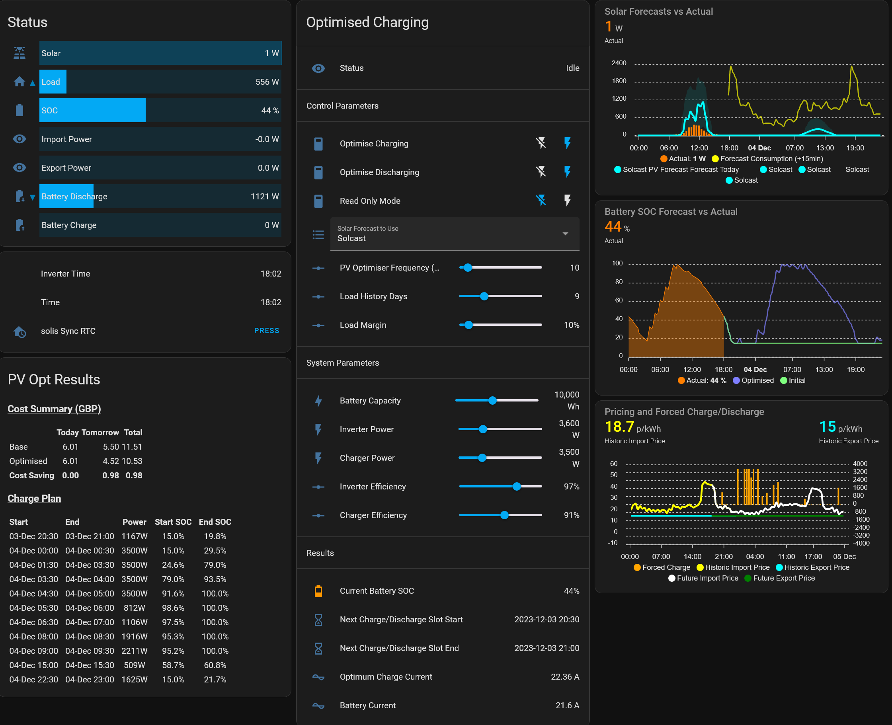

# PV Opt: Home Assistant Solar/Battery Optimiser v3.2.2

Solar / Battery Charging Optimisation for Home Assistant. This appDaemon application attempts to optimise charging and discharging of a home solar/battery system to minimise cost electricity cost on a daily basis using freely available solar forecast data from SolCast. This is particularly beneficial for Octopus Agile but is also benefeficial for other time-of-use tariffs such as Octopus Flux or simple Economy 7.

The application will integrate fully with Solis inverters which are controlled using the [Home Assistant Solax Modbus Integration](https://github.com/wills106/homeassistant-solax-modbus) and once installed should require miminal configuratuon. Other inverters/integrations can be added if required or can be controlled indirectly using auytomations.

It has been tested primarily with Octopus tariffs but other tariffs can be manually implemented.

<h2>Pre-requisites</h2>

This app is not stand-alone it requires the following:

|| ||
|:----|:--|:--|
|<b><u>Websites |
| Solcast Hobby Account | Required | Provides solar PV generation forecasts up to 10 times per day,
| <b><u>Add-ons</b></u>|
|HACS| Required| Home Assistant Community Store - used to distribute the app and updates 
|AppDaemon | Required | Python execution environment
| Mosquitto MQTT Broker | Optional | Used to create Home Assistant Entities using MQTT Discovery . <b><i>PV Opt</b></i> will run without this but you will have less control.
| File Editor| Required | Used to edit the `appdaemon.yaml` and `config.yaml` files. Alternatively you could use `Samba Share` or `Studio Code Server`
| Samba Share| Alternative| Alternative to using File Editor to edit config files. Not convered in this guide.
| Studio Code Server| Alternative|Alternative to using `File Editor` to edit config files. Not convered in this guide.
| <u><b>Integrations</b></u> | | |
|Solcast PV Solar Integration | Required | Retrieves solar forecast from Solcast into Home Assistant |
|Octopus Energy | Optional | Used to retrieve tariff information and Octopus Saving Session details|
|Solax Modbus | Optional | Used to control Solis inverter directly. Support for other integrations and inverter brands is possible.

<h2>Step by Step Installation Guide</h2>

<h3>1. Get a Solcast Hobby Account</h3>


<b>PV_Opt</b> relies on solar forecasts data from Solcast. You can sign up for a Private User account [here](https://solcast.com/free-rooftop-solar-forecasting?gclid=CjwKCAiAr4GgBhBFEiwAgwORrQp6co5Qw8zNjEgUhBee7Hfa39_baEWG-rB-GB3FFpiaIA5eAPHhahoC3vAQAvD_BwE). This licence gives you 10 (it used to be 50 🙁) API calls a day.

<h3>2. Install HACS</h3>

1. Install HACS: https://hacs.xyz/docs/setup/download
2. Enable AppDaemon in HACS: https://hacs.xyz/docs/categories/appdaemon_apps/

<h3>3. Install the Solcast PV Solar Integration (v4.0.x)</h3>

1. Install the integation via HACS: https://github.com/oziee/ha-solcast-solar
2. Add the Integration via Settings: http://homeassistant.local:8123/config/integrations/dashboard
3. Once installed configure using your Solcast API Key from (1) . 
4. Set up an automation to update according to your desired schedule. Once every 3 hours will work.

<h3>4. Install the Octopus Energy Integration (If Required)</h3>


This excellent integration will pull Octopus Price data in to Home Assistant. Solar Opt pulls data from Octopus independently of this integration but will extract current tariff codes from it if they are avaiable. If not it will either use account details supplied in `secrets.yaml` or explicitly defined Octopus tariff codes set in `config.yaml`.


<h3>5. Install the Integration to Control Your Inverter</h3>

At present this app only works directly with Solis hybrid inverters using either the Solax Modbus integration (https://github.com/wills106/homeassistant-solax-modbus) or the HA Core Modbus as described here: https://github.com/fboundy/ha_solis_modbus. Support for other inverters will  follow.

<h4>Solax Modbus:</h4>

1. Install the integration via HACS: https://github.com/wills106/homeassistant-solax-modbus
2. Add the Integration via Settings: http://homeassistant.local:8123/config/integrations/dashboard
3. Configure the connection:
    |||
    |:--|:--|
    | Prefix| solis|
    |Interface| TCP/Ethernet|
    |Inverter Type| solis|
    |IP Address| IP of your datalogger|
    |TCP Port| 502|
    |Protocol| Modbus TCP|
4. Check that you have comms with the inverter and the various entities in the integration are populated with data

<4>HA Core Modbus</h4>

Follow the Github instructions here: https://github.com/fboundy/ha_solis_modbus

<h3>6. Install the MQTT Integraion in Home Assistant</h3>

1. Click on the button below to add the MQTT integration:

    [](https://my.home-assistant.io/redirect/config_flow_start?domain=mqtt)


<h3>7. Install Mosquitto MQTT Broker</h3>

1. Click the Home Assistant My button below to open the add-on on your Home Assistant instance:

   [](https://my.home-assistant.io/redirect/supervisor_addon/?addon=a0d7b954_appdaemon&repository_url=https%3A%2F%2Fgithub.com%2Fhassio-addons%2Frepository)

2. Click on Install

3. Configure the Add-On as per the documentation: http://homeassistant.local:8123/hassio/addon/core_mosquitto/documentation

4. Either save the MQTT username and password in your `secrets.yaml` file or make a note of them for later.

<h3>8. Install File Editor</h3>

<h3>9. Install Samba Share and/or Studio Code Server Add-ons If Required</h3>

Both of these add-ons make it easier to edit text files on your HA Install but aren't strictly necessary. `Samba Share` also makes it easier to access the AppDaemon log files.

<h3>10. Install AppDaemon</h3>

The <b>PV_Opt</b> python script currently runs under AppDaemon.

AppDaemon is a loosely coupled, multi-threaded, sandboxed python execution environment for writing automation apps for home automation projects, and any environment that requires a robust event driven architecture. The simplest way to install it on Home Assistantt is using the dedicated add-on:

1. Click the Home Assistant My button below to open the add-on on your Home Assistant instance:

   [](http://homeassistant.local:8123/hassio/addon/core_mosquitto/info)

2. Click on <b>Install</b>

3. Turn on <b>Auto update</b>

<h3>9. Configure AppDaemon</h3>

1. Use `File Editor` (or one of the alternatives) to open `/addon_configs/a0d7b954_appdaemon/appdaemon.yaml`.

2. The suggested configuration is as follows. This assumes that you are using `secrets.yaml` for your password information. If not then the `secrets` entry can be deleted and the `MQTT` `client_user` and `client password` will need to be entered explicitly.

        secrets: //homeassistant/secrets.yaml
        appdaemon:
          latitude: 54.729
          longitude: -2.991
          elevation: 175
          time_zone: Europe/London
          thread_duration_warning_threshold: 45
          app_dir: /homeassistant/appdaemon/apps
          plugins:
            HASS:
              type: hass
            MQTT:
              type: mqtt
              namespace: mqtt #
              verbose: True
              client_host: core-mosquitto
              client_port: 1883
              client_id: localad
              event_name: MQTT_MESSAGE 
              client_topics: NONE
              client_user: !secret mqtt-user
              client_password: !secret mqtt-password

        http:
        url: http://127.0.0.1:5050
        admin:
        api:
        hadashboard:

3. It is also recommended that you add the following entries to `appdaemon.yaml` to improve AppDaemon logging. These settings assume that you have a `/share/logs` folder setup using `Samba Share`.

        logs:
          main_log:
            filename: /share/logs/main.log
            date_format: '%H:%M:%S'
          error_log:
            filename: /share/logs/error.log
            date_format: '%H:%M:%S'    
          pv_opt_log:
            name: PV_Opt
            filename: /share/logs/pv_opt.log
            date_format: '%H:%M:%S'      
            format: '{asctime} {levelname:>8s}: {message}'

4. Open the AppDaemon Add-On via Settings: http://homeassistant.local:8123/hassio/addon/a0d7b954_appdaemon/info

5. Click on <b>Configuration</b> at the top

6. Click the 3 dots and <b>Edit in YAML</b> to add `numpy==1.25` and `pandas` as a Python package (note that `numpy` versions >1.25 appear to cause installation errors with appDaemon):

   ```
   init_commands: []
   python_packages:
     - numpy == 1.25
     - pandas
   system_packages: []

   ```

7. Go back to the <b>Info</b> page and click on <b>Start</b>

8. Click on <b>Log</b>. Appdaemon will download and install numpy and pandas. Click on <b>Refresh</b> until you see:

   ```
    s6-rc: info: service init-appdaemon successfully started
    s6-rc: info: service appdaemon: starting
    s6-rc: info: service appdaemon successfully started
    s6-rc: info: service legacy-services: starting
    [12:54:30] INFO: Starting AppDaemon...
    s6-rc: info: service legacy-services successfully started
   ```

9. Either click on `Info` followed by `OPEN WEB UI` and then `Logs` or open your `main_log` file from the location specified in step (3) above. You should see:

    ```
    13:16:24 INFO AppDaemon: AppDaemon Version 4.4.2 starting
    13:16:24 INFO AppDaemon: Python version is 3.11.6
    13:16:24 INFO AppDaemon: Configuration read from: /config/appdaemon.yaml
    13:16:24 INFO AppDaemon: Added log: AppDaemon
    13:16:24 INFO AppDaemon: Added log: Error
    13:16:24 INFO AppDaemon: Added log: Access
    13:16:24 INFO AppDaemon: Added log: Diag
    13:16:24 INFO AppDaemon: Added log: PV_Opt
    13:16:25 INFO AppDaemon: Loading Plugin HASS using class HassPlugin from module hassplugin
    13:16:25 INFO HASS: HASS Plugin Initializing
    13:16:25 WARNING HASS: ha_url not found in HASS configuration - module not initialized
    13:16:25 INFO HASS: HASS Plugin initialization complete
    13:16:25 INFO AppDaemon: Loading Plugin MQTT using class MqttPlugin from module mqttplugin
    13:16:26 INFO MQTT: MQTT Plugin Initializing
    13:16:26 INFO MQTT: Using 'localad/status' as Will Topic
    13:16:26 INFO MQTT: Using 'localad/status' as Birth Topic
    13:16:26 INFO AppDaemon: Initializing HTTP
    13:16:26 INFO AppDaemon: Using 'ws' for event stream
    13:16:26 INFO AppDaemon: Starting API
    13:16:26 INFO AppDaemon: Starting Admin Interface
    13:16:26 INFO AppDaemon: Starting Dashboards
    13:16:26 INFO HASS: Connected to Home Assistant 2023.11.1
    13:16:26 INFO AppDaemon: Starting Apps with 0 workers and 0 pins
    13:16:26 INFO AppDaemon: Running on port 5050
    13:16:26 INFO MQTT: Connected to Broker at URL core-mosquitto:1883
    13:16:26 INFO AppDaemon: Got initial state from namespace mqtt
    13:16:26 INFO MQTT: MQTT Plugin initialization complete
    13:16:26 INFO HASS: Evaluating startup conditions
    13:16:26 INFO HASS: Startup condition met: hass state=RUNNING
    13:16:26 INFO HASS: All startup conditions met
    13:16:26 INFO AppDaemon: Got initial state from namespace default
    13:16:28 INFO AppDaemon: Scheduler running in realtime
    13:16:28 INFO AppDaemon: Adding /homeassistant/appdaemon/apps to module import path
    13:16:28 INFO AppDaemon: App initialization complete
    ```

That's it. AppDaemon is up and running. There is futher documentation for the on the [Add-on](https://github.com/hassio-addons/addon-appdaemon/blob/main/appdaemon/DOCS.md) and for [AppDaemon](https://appdaemon.readthedocs.io/en/latest/)

<h3>Install PV Opt from HACS</h3>

  1. Go to HACS
  2. Select `Automation`
  3. Click on the 3 dots top right and `Add Custom Repository`
  4. Add this repository https://github.com/fboundy/pv_opt and select `AppDaemon` as the `Category`
  5. Download the app

Once downloaded AppDaemon should see the app and attempt to load it using the default configuration. Go back to the AppDaemon logs and this time open pv_opt_log. You should see:

  ```
  16:53:23     INFO: ******************* PV Opt v3.0.1 *******************
  16:53:23     INFO: 
  16:53:23     INFO: Time Zone Offset: 0.0 minutes
  16:53:23     INFO: Reading arguments from YAML:
  16:53:23     INFO: -----------------------------------
  16:53:23     INFO: 
  16:53:23     INFO: Checking config:
  16:53:23     INFO: -----------------------
  16:53:23  WARNING:     forced_charge       = True   Source: system default. Not in YAML.
  16:53:23  WARNING:     forced_discharge    = True   Source: system default. Not in YAML.
  16:53:23  WARNING:     read_only           = True   Source: system default. Not in YAML.
  ```

<h2>Configuration</h2>

If you have the Solcast, Octopus and Solax integrations set up as specified above, there should be minimal configuration required. <b><i>PV_Opt</b></i> needs to know the size of your battery and the power of your inverter: both when inverting battery to AC power and when chargingh tha battery. It will attempt to work these out from the data it has loaded (WIP) but you should check the following enitities in Home Assistant:

| Parameter | Units | Entity | Default Value |
| :-- | :--: | :--| :--:|
| Battery Capacity| Wh| `number.pvopt_batter_capacity_wh` | 10000|
| Inverter Power | W | `number.pvopt_inverter_power_watts` | 3600 |
| Charger Power | W | `number.pvopt_charger_power_watts` | 3500 |

If you are running a different integration or inverter brand you will need to edit the `config.yaml` file to select the correct `inverter_type`:

    inverter_type: SOLIS_CORE_MODBUS

There are then only a few things to control the optimisation process. 

| Parameter | Units | Entity | Default | Description |
|:--|:--:| :-- | :--:|:--|
| Read Only Mode | `on`/`off` | `switch.pvopt_read_only` | On | Controls whether the app will actually control the inverter. Start with this on until you are happy the charge/discharge plan makes sense.
| Optimise Charging | `on`/`off` | `switch.pvopt_forced_charge` | On | Controls whether the app will calculate an Optimised plan. If `off` only the Base forecast will be updated.
| Optimise Discharging | `on`/`off` | `switch.pvopt_forced_discharge` | On | Controls whether the app will allow for forced discharge as well as charge
| Solar Forecast | `select`| `select.pvopt_solar_forecast` | Solcast | Selects which Solcast to use (Most Likely, 10% or 90%)
| Optimser Frequency | minutes | `number.pvopt_optimise_frequency_minutes` | 10 | Frequency of Optimiser calculation |
| Load History Days | days | `number.pvopt_consumption_history_days` | 7 | Number of daya of consumption history to use when predicting future load |
| Load Margin | % | `number.pvopt_consumption_margin` | 10% | Margin to add to historic load for forecast (safety factor) |

<h2>Output</h2>

The app always produces a Base forecast of future battery SOC and the associated grid flow based on the forecast solar performance, the expected consumption and prices with no forced charging or discharging from the grid.. The total cost for today and tomorrow is written to `sensor.pvopt_base_cost` and the associated SOC vs time is written to the attributes of this entity allowing it to be graphes using `apex-charts`.

If `Optimise Charging` is enabled, an optimsised charging plan is calculated and writtemt to `sensor.pvopt_opt_cost`. This will also include a list of forced charge and discharge windows.

The easiest way to control and visualise this is through the `pvopt_dashboard.yaml` Lovelace yaml file included in this repo. Note that you will need to manually paste this into a dashboard and edit the charts to use the correct Octopus Energy sensors:


