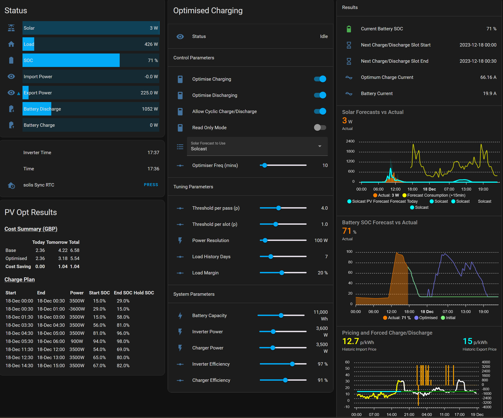

# Home Assistant Solar Optimiser v2.1.0

Solar / Battery Charging Optimisation for Home Assistant. This appDaemon application attempts to optimise charging and discharging of a home solar/battery system to minimise cost electricity cost on a daily basis using freely available solar forecast data from SolCast. This is particularly beneficial for Octopus Agile but is also benefeficial for other time-of-use tariffs such as Octopus Flux or simple Economy 7.

It has been tested primarily with Octopus tariffs but other tariffs can be manually implemented.

<h2>Pre-requisites</h2>

This app is not stand-alone it requires the following:

<h3>Solcast Hobby Account</h3>


<b>Solar_Opt</b> relies on solar forecasts data from Solcast. You can sign up for a Private User account [here](https://solcast.com/free-rooftop-solar-forecasting?gclid=CjwKCAiAr4GgBhBFEiwAgwORrQp6co5Qw8zNjEgUhBee7Hfa39_baEWG-rB-GB3FFpiaIA5eAPHhahoC3vAQAvD_BwE). This licence gives you 10 (it used to be 50 🙁) API calls a day.

<h3>Solcast PV Solar Integration (v4.0.x)</h3>

[](https://github.com/oziee/ha-solcast-solar)

This integrates Solcast into Home Assistant. Once installed configure using your Solcast API Key. Unless you have a legacy account with 50 API calls I suggest you tick the option to <b>Disable auto API polling</b> and set up an automation to update according to your desired schedule. Once every 3 hours will work.

<h3>AppDaemon</h3>

The <b>Solar_Opt</b> python script currently runs under AppDaemon.

AppDaemon is a loosely coupled, multi-threaded, sandboxed python execution environment for writing automation apps for home automation projects, and any environment that requires a robust event driven architecture. The simplest way to install it on Home Assistantt is using the dedicated add-on:

1. Click the Home Assistant My button below to open the add-on on your Home Assistant instance:

   [](https://my.home-assistant.io/redirect/supervisor_addon/?addon=a0d7b954_appdaemon&repository_url=https%3A%2F%2Fgithub.com%2Fhassio-addons%2Frepository)

2. Click on <b>Install</b>

3. Turn on <b>Watchdog</b> and <b>Auto update</b>

4. Click on <b>Configuration</b> at the top

5. Click the 3 dots and <b>Edit in YAML</b> to add `pandas` as a Python package:

   ```
   init_commands: []
   python_packages:
     - pandas
   system_packages: []

   ```

6. Go back to the <b>Info</b> page and click on <b>Start</b>

7. Click on <b>Log</b>. Appdaemon will download and install numpy and pandas. Click on <b>Refresh</b> until you see:

   ```
   INFO AppDaemon: Initializing app hello_world using class HelloWorld from module hello
   INFO hello_world: Hello from AppDaemon
   INFO hello_world: You are now ready to run Apps!
   INFO AppDaemon: App initialization complete
   INFO AppDaemon: New client Admin Client connected
   ```

That's it. AppDaemon is up and running. There is futher documentation for the on the [Add-on](https://github.com/hassio-addons/addon-appdaemon/blob/main/appdaemon/DOCS.md) and for [AppDaemon](https://appdaemon.readthedocs.io/en/latest/)

<h3>Home Assistant Octopus Energy Integration v8.4.x (Optional)</h3>

[](https://github.com/BottlecapDave/HomeAssistant-OctopusEnergy)

This excellent integration will pull Octopus Price data in to Home Assistant. Solar Opt pulls data from Octopus independently of this integration but will extract current tariff codes from it if they are avaiable. If not it will either use account details supplied in `secrets.yaml` or explicitly defined Octopus tariff codes set in `config.yaml`.

<h2>Installation</h2>

Once AppDaemon is installed simply download `solar_opt.py`, `pvpy.py` and `config.yaml` from this repo and copy them to `/config/appdaemon/apps/ha_solar_opt`. AppDaemon will start running the app immediately but you will almost certainly need to update the configuration first.

<h2>Configuration</h2>

All configuration is done by editing the parameters in the `/config/appdaemon/apps/ha_solar_opt/config.yaml` file. Many of the parameters can also be pointed to a Home Assistant entity rather than entering the parameter explicitly. This allows parameters to be updated dynamically from Home Assistant. In the example below `maximum_dod_percent` is taken from a sensor but `charger_power_watts` is set explicitly:

    maximum_dod_percent: sensor.solis_overdischarge_soc
    charger_power_watts: 3500

<h3>Required parameters:</h3>

| Name          |  Type   |   Default   | Can Point to Entity | Description                                                              |
| ------------- | :-----: | :---------: | :-----------------: | ------------------------------------------------------------------------ |
| module        | string  | `solar_opt` |       `false`       | Internal reference for AppDaemon <b>DO NOT EDIT</b>                      |
| class         | string  | `SolarOpt`  |       `false`       | Internal reference for AppDaemon <b>DO NOT EDIT</b>                      |
| manual_tariff | boolean |   `false`   |       `false`       | Use manual tariff data rather than from the Octopus Energy integration\* |

\*This feature is not yet implemented

<h3>Manual Tariff Parameters *Not Yet Implemented*</h3>

These are all required if `manual_tariff` is `true`. Any number of import or export time periods can be specified using sequential suffixes `_1`, `_2` etc. Each time period must have a start time and a price. Any periods with one and not the other will be ignored.

| Name                  |   Type    | Default | Can Point to Entity | Description                                                    |
| --------------------- | :-------: | :-----: | :-----------------: | -------------------------------------------------------------- |
| import_tariff_1_price |  `float`  |         |       `true`        | Import prices p/kWh for Import Time Slot 1                     |
| import_tariff_1_start |  `time`   |         |       `true`        | Start time for Import Time Slot 1                              |
| import_tariff_2_price |  `float`  |         |       `true`        | Import prices p/kWh for Import Time Slot 2                     |
| import_tariff_2_start |  `time`   |         |       `true`        | Start time for Import Time Slot 2                              |
| export_tariff_1_price |  `float`  |         |       `true`        | Export prices p/kWh for Export Time Slot 1                     |
| export_tariff_1_start |  `time`   |         |       `true`        | Start time for Export Time Slot 1                              |
| dst_time_shift        | `boolean` | `false` |       `true`        | Controls whether times will shift with DST or are fixed in UTC |

<h3>Octopus Account Parameters</h3>

These are required if `manual_tariff` is `false`. If `octopus_auto` is `true` the remaining parameters will be detected automatically and can be omitted. Optionally (and be default) these parameters can also be read from the `secrets.yaml` file.

| Name                       |   Type    |          Default          | Can Point to Entity | Description                                                                                                             |
| --------------------- | :-------: | :-----: | :-----------------: | -------------------------------------------------------------- |
| octopus_auto               | `boolean` |          `true`           |       `false`       | Automatically get as many as possible of the remaining Octopus parameters directly from the Octopus Energy integration. |
| octopus_account            | `string`  | `!secret octopus_account` |       `false`       | Octopus Account number (specifed in `secrets.yaml` by default )                                                         |
| octopus_api_key            | `string`  | `!secret octopus_api_key` |       `false`       | Octopus API Key (specifed in `secrets.yaml` by default )                                                                |     |
| octopus_import_tariff_code | `string`  |                           |       `false`       | The Octopus import tariff code                                                                                          |
| octopus_export_tariff_code | `string`  |                           |       `false`       | The Octopus export tariff code. Omit if there is no export                                                              |

<h3>Plant Configuration Parameters</h3

All of these are required but will be defaulted if not specified.

| Name                        |   Type   |          Default           | Can Point to Entity | Description                            |
| --------------------------- | :------: | :------------------------: | :-----------------: | -------------------------------------- |
| battery_capacity_Wh         |  `int`   |           10000            |       `true`        | Installed battery capacity [Wh]        |
| inverter_loss_watts         |  `int`   |             90             |       `true`        | Inverter standby power requirement [W] |
| inverter_efficiency_percent |  `int`   |             97             |       `true`        | Inverter (DC->AC) efficiency [%]       |
| charger_efficiency_percent  |  `int`   |             91             |       `true`        | Charger (AC->DC) efficiency [%]        |
| charger_power_watts         |  `int`   |            3000            |       `true`        | Charger power [W]                      |
| inverter_power_watt         |  `int`   |            3500            |       `true`        | Charger power [W]                      |
| maximum_dod_percent         |  `int`   |             15             |       `true`        | Battery maximum Depth of Discharge [%] |
| battery_voltage             | `float`  |            52.0            |       `true`        | Nominal battery voltage [V]            |
| entity_id_battery_soc:      | `string` | `sensor.solis_battery_soc` |     `required`      | Entity that reports battery SOC        |

<h3>Solcast Configuration</h3>

If the 3rd party Solcast integration is used all of these can be defaulted. Note that you should not use both the internal Solcast API calls and the Solcast Integration - you will use up your 10 daily API calls twice as fast! Results from the internal API calls are not written to any Home Assistant Entities.

| Name                      |   Type    |                    Default                     | Can Point to Entity | Description                                                                                           |
| ------------------------- | :-------: | :--------------------------------------------: | :-----------------: | ----------------------------------------------------------------------------------------------------- |
| solcast_integration       | `boolean` |                     `true`                     |      `false `       | Controls whether the 3rd Party Solcast integration is used or Solcast is queried directly by SolarOpt |
| solcast_today             | `string`  |  `sensor.solcast_pv_forecast_forecast_today`   |     `required`      | Solcast Integration entity for today's forecast (stored as attributes)\*                              |
| solcast_tomorrow          | `string`  | `sensor.solcast_pv_forecast_forecast_tommorow` |     `required`      | Solcast Integration entity for tomorrow's forecast (stored as attributes)\*                           |
| solcast_api_key           | `string`  |           `!secret solcast_api_key`            |       `false`       | Solcast API Key for internal API calls                                                                |
| solcast_api_polling_hours |  `int `   |                       3                        |       `true`        | Hours between API calls for internal polling                                                          |

<h3>Solar and Consumption Forecast Parameters</h3>

| Name                    |   Type    |  Default  | Can Point to Entity | Description                                                                                                                                                                    |
| ----------------------- | :-------: | :-------: | :-----------------: | ------------------------------------------------------------------------------------------------------------------------------------------------------------------------------ |
| solar_forecast          | `string`  | `Solcast` |       `true`        | Valid options are `Solcast` (Solcast mid-case), `Solcast_p90` (Solcast high), `Solcast_p10` (Solcast low), `Solcast_Swanson` (Solcast weighted mean)                           |
| consumption_from_entity | `boolean` |  `true`   |       `true`        | Controls whether to use an entity to get historic consumption (`true`) or to use a model of typical consumption vs time together with an estimated daily consumption (`false`) |
| entity_id_consumption:  | `string`  |           |     `required`      | Entity that reports consumption                                                                                                                                                |
| consumption_days        |   `int`   |     7     |       `true`        | Number of days history to use                                                                                                                                                  |
| consumption_grouping    | `string`  |  `mean`   |       `true`        | Grouping method for consumption history: `mean`, `median`, `max`                                                                                                               |
| daily_consumption_Wh    |   `int`   |   11000   |       `true`        | Estimated daily consumption: only required if `consumption_from_entity` is `false`                                                                                             |

<!-- <h3>Charging Time Parameters</h3>

If `charge_auto_select` is `true` the charge times will be detected automatically and can be omitted.

| Name               |   Type    | Default | Can Point to Entity | Description                                                                                                   |
| ------------------ | :-------: | :-----: | :-----------------: | ------------------------------------------------------------------------------------------------------------- |
| charge_auto_select | `boolean` | `true`  |       `true`        | Controls whether to automatically detect optimum charge times (forced to `true` for Agile import tariffs)     |
| charge_fixed_start |  `time`   |         |       `true`        | Fixed charging start time (UTC)                                                                               |
| charge_fixed_end   |  `time`   |         |       `true`        | Fixed charging end time (UTC)                                                                                 |
| default_target_soc |   `int`   |   100   |       `true`        | Default un-optimised target SOC. Charge current will be calculated for this SOC if `optimise_flag` is `false` |
| optimise_flag:     | `boolean` | `true`  |       `true`        | Controls whether to optimise charging time and target SOC                                                     | -->

<!-- <h3>Alternative Octopus Tariffs</h3>

Optionally the app will generate the Optimised Cost for an any number alternative pairs of Import and Export tariffs selected from the following list. The format for the parameter in `config.yaml` is:

    alt_import_{import_name}_export_{export_name}: true

Valid import names are:

| Name  | Current Product Code | Comment                           |
| ----- | -------------------- | --------------------------------- |
| Agile | AGILE-FLEX-22-11-25  | \*\* Not yet implemented          |
| Cosy  | COSY-22-12-08        |
| Flux  | FLUX-IMPORT-23-02-14 | Must be combined with Flux Export |
| Go    | GO-VAR-22-10-14      | Requires an EV                    |
| Eco7  | VAR-22-10-01         |

Valid import names are:

| Name  | Current Product Code          | Comment                                           |
| ----- | ----------------------------- | ------------------------------------------------- |
| Agile | AGILE-OUTGOING-19-05-13       |                                                   |
| Flux  | FLUX-EXPORT-23-02-14          | Must be combined with Flux Import                 |
| Fixed | OUTGOING-FIX-12M-19-05-13     | Only availabe with certain Octopus Import tariffs |
| SEG   | OUTGOING-SEG-FIX-12M-20-07-07 |                                                   |

For example, to generate alternative optimised prices for Flux, Go/SEG and Eco7/Agile would require:

    alt_import_flux_export_flux: true
    alt_import_go_export_seg: true
    alt_import_agile_export_agile: true

The resulting output for each is written to a sensor: `sensor.solaropt_import_{import_name}_export_{export_name}`. You can track these over time to see if you would be better off with a different tariff. -->

<h2>Triggering the App</h2>

The app will load into AppDaemon on startup. To check open the [AppDaemon UI Main Log](http://homeassistant.local:5050/aui/index.html#/logs). If it is blank simply open and save `solar_opt.py` file to force an update. You should see:

    2023-03-03 10:11:12.803829 INFO solar_opt: ******** Waiting for SOLAR_OPT Event *********
    2023-03-03 10:11:12.801661 INFO solar_opt: ************ SolarOpt Initialised ************
    2023-03-03 10:11:12.778445 INFO solar_opt: *************** SolarOpt v2.1.0 ***************
    2023-03-03 10:11:12.765458 INFO AppDaemon: Initializing app solar_opt using class SolarOpt from module solar_opt
    2023-03-03 10:11:12.736458 INFO AppDaemon: Reloading Module: /config/appdaemon/apps/ha_solar_opt/solar_opt.py

The app is triggered by firing the Home Assistant Event `SOLAR_OPT` which can be done from <b>Developer Tools</b> or via an Automation. If you manually fire an event you should see something like the below appear in the log:

    2023-03-03 10:19:00.841601 INFO solar_opt: Optimum SOC: 20% with net cost GBP 1.90
    2023-03-03 10:19:00.257332 INFO solar_opt: Net cost (no optimisation): GBP 1.94
    2023-03-03 10:19:00.254542 INFO solar_opt: Reference cost (no solar): GBP10.29
    2023-03-03 10:19:00.205972 INFO solar_opt: Charging slot end 2023-03-04 07:30:00+00:00
    2023-03-03 10:19:00.201941 INFO solar_opt: Charging slot start 2023-03-04 00:30:00+00:00
    2023-03-03 10:19:00.186961 INFO solar_opt: ** Estimated load loaded OK **
    2023-03-03 10:18:58.033455 INFO solar_opt: Getting expected load data
    2023-03-03 10:18:58.031026 INFO solar_opt: ** Solcast forecast loaded OK **
    2023-03-03 10:18:58.007462 INFO solar_opt: Getting Solcast data
    2023-03-03 10:18:58.005448 INFO solar_opt: ** Export tariff price data loaded OK **
    2023-03-03 10:18:57.986234 INFO solar_opt: Export sensor: sensor.octopus_energy_electricity_19m1234567_1650000123456_export_current_rate
    2023-03-03 10:18:57.983947 INFO solar_opt: ** Import tariff price data loaded OK **
    2023-03-03 10:18:57.960583 INFO solar_opt: Import sensor: sensor.octopus_energy_electricity_19m1234567_1650000654321_current_rate
    2023-03-03 10:18:57.945932 INFO solar_opt: ********* SOLAR_OPT Event triggered **********

<h2>Output</h2>

Solar Opt writes to the following Home Assistant enities:

| Name                                   | State / Attributes |    Type    | Description                                            |
| -------------------------------------- | :----------------: | :--------: | ------------------------------------------------------ |
| sensor.solaropt_next_charge_start      |       state        | `datetime` | Next charging slot start                               |
| sensor.solaropt_next_charge_end        |       state        | `datetime` | Next charging slot end                                 |
| sensor.solaropt_next_charge_current    |       state        |  `float`   | Calculated charge current required in the next slot    |
| sensor.solaropt_next_discharge_start   |       state        | `datetime` | Next discharging slot start                            |
| sensor.solaropt_next_discharge_end     |       state        | `datetime` | Next discharging slot end                              |
| sensor.solaropt_next_discharge_current |       state        |  `float`   | Calculated discharge current required in the next slot |

<h2>Development</h2>

This app is still in development. Expect things not to work!

Please use [GitHub Issues](https://github.com/fboundy/ha_solar_opt/issues) to feedback bugs, issues and feature requests. Please check through the existing issues first and use appropriate labels.

Anyone who wants to help with the development is welcome.

<h2>FAQs</h2>
<h3>What Does It Do?</h3>

The app attempts to optimise the the charge applied to a battery tied to a PV inverter so that the overall cost is minimised. If a dual rate tariff such as Economy7 is used, in the winter it often makes sense to fully charge the battery overnight. In full summer it may make sense not to charge it at all as sufficient surplus from the day will keep the battery charged overnight. However on cloudy summwer days and in spring/autumn the optimum is less obvious. The app attempts to predict the optimum target State of Charge (SOC) to aim for overnight depending on:

- The day and night tariffs
- The expected solar yield for the following day
- The expected consumption for the following day

The optimum SOC is output as a Home Assistant sensor. The user can then use this in any way they see fit to programme their system: either through an Automation or manually. As such, the ability to write to the inverter is not an absolute requirement.

<h3>What Solar Forecast Should I Use?</h3>

You can choose to use any of the three confidence levels that Solcast delivers (10% = low, Base, 90% = high)

<!-- You can choose to use any of the three confidence levels that Solcast delivers (10% = low, Base, 90% = high) or you can used the Swanson's Mean approach. -->

Depending on the forecast and the relative Day/Night tariffs and whether one has an export contract, it is often that the marginal cost of over-charging is low: Octopus Agile export rates during the day are often similar to Octopus Economy 7 Night import rates. However, the marginal cost of under-charging is high due to the fact that you will end up using Day rate electricity in the evening/overnight.

<!-- The safest option is therefore to use `Solcast_p10`. However if the sun delivers at the top end of the range this will be sub-optimal. The `Solis_Swanson` approach calclates the cashflows at all 3 confidence levels and then weights them 30:40:30 to optimise on an expected cost. This <i>should</i> be the optimum approach, particularly if you have no export contract. -->

The safest option is therefore to use `Solcast_p10`. However if the sun delivers at the top end of the range this will be sub-optimal.

<h3>Where Does the Forecast Consumption Come From?</h3>

There are two options which are controled by the `consumption_from_entity` flag:

If this paramter is `true` the user defines an entity which contains consumption data. This is then averaged on a half-hourly basis over a given number of days. This is probably one of the big uncertainties in the forecast. Suggested improvements are welcome.

If it is `false` then an estimate of daily consumpion in Wh is combined with a typical daily profile ([source](https://www.researchgate.net/publication/324141791_The_potential_for_peak_shaving_on_low_voltage_distribution_networks_using_electricity_storage/download)) to genrate a simulated load vs time. Use this option if you don't hava a suitable entity in Home Assistant which captures your load.

<h3>Does It Work With Agile?</h3>

It definitely works with Agile Export. Agile import is more challenging as the optimum charging slot is not fixed. I haven't been able to test Agile Import fully yet.

<h2>Plotting Output and Input Data *Incomplete*</h2>

`solar_opt_apex_charts.yaml` can be used to plot the output using [Apex Charts](https://github.com/RomRider/apexcharts-card)

[](https://my.home-assistant.io/redirect/supervisor_addon/?addon=a0d7b954_appdaemon&repository_url=https%3A%2F%2Fgithub.com%2Fhassio-addons%2Frepository)

<h2>Basic Dashboard</h2>

<h2>Automations and Scripts</h2>
The following automations and scripts are provided to implement timed charging with specific inverters and integration:

<h3>Solis Inverter with Home Assistand Modbus Control</h3>

<h3>Solis Inverter with Solis API Control</h3>
