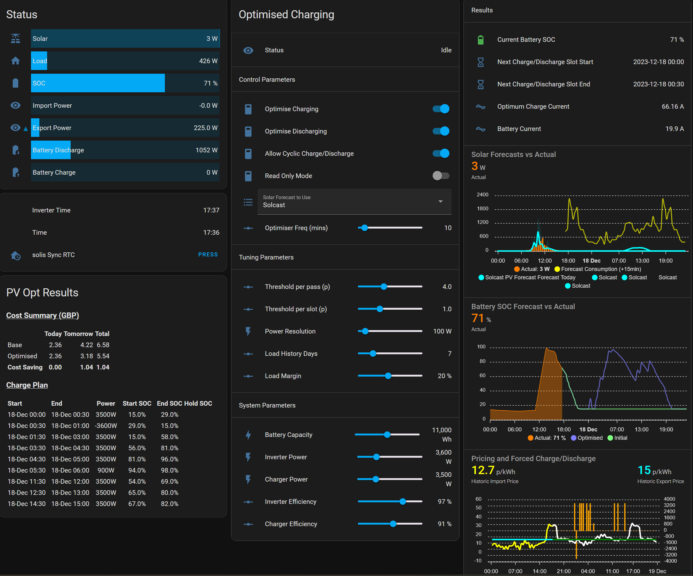

# PV Opt: Home Assistant Solar/Battery Optimiser v5.1.7

<h2>*** Announcement *** </h2>

Pv_opt is now available as an HomeAssistant App (formely known as an AddOn)

No changes to config.yaml are required.

The code that is run is identical to that in AppDaemon, so functionality is identical and no changes to Dashboards are needed. 

For upgrade instructions, please see https://github.com/stevebuk1/pv_opt_app


&nbsp;


- [Introduction](#Introduction)
- [Pre-requisites](#pre-requisites)
- [Step by Step Installation Guide](#step-by-step-installation-guide)
  - [1. Get a Solcast Hobby Account](#1-get-a-solcast-hobby-account)
  - [2. Install HACS](#2-install-hacs)
  - [3. Install the Solcast PV Solar Integration (v4.1.x)](#3-install-the-solcast-pv-solar-integration-v41x)
  - [4. Install the Octopus Energy Integration (If Required)](#4-install-the-octopus-energy-integration-if-required)
  - [5. Install the Axle Energy VPP Integration (If Required)](#5-install-the-axle-energy-VPP-integration-if-required)
  - [6. Install the Integration to Control Your Inverter](#6-install-the-integration-to-control-your-inverter)
    - [Solax Modbus](#solax-modbus)
    - [HA Core Modbus](#ha-core-modbus)
    - [Using Solis Cloud](#using-solis-cloud)
  - [7. Install the MQTT Integration in Home Assistant](#7-install-the-mqtt-integraion-in-home-assistant)
  - [8. Install Mosquitto MQTT Broker](#8-install-mosquitto-mqtt-broker)
  - [9. Install File Editor](#9-install-file-editor)
  - [10. Install Samba Share and/or Studio Code Server Add-ons If Required](#10-install-samba-share-andor-studio-code-server-add-ons-if-required)
  - [11. Install AppDaemon](#11-install-appdaemon)
  - [12. Configure AppDaemon](#12-configure-appdaemon)
  - [13. Install PV Opt from HACS](#13-install-pv-opt-from-hacs)
  - [14. Add an Automation to Restart AppDaemon when HA Restarts (Optional)](#14-add-an-automation-to-restart-appdaemon-when-ha-restarts-optional)
- [Configuration](#configuration)
  - [System Parameters](#system-parameters)
  - [Control Parameters](#control-parameters)
  - [Consumption Parameters](#consumption-parameters)
  - [EV Parameters](#ev-parameters)
  - [Pricing Parameters](#pricing-parameters)
    - [Octopus Tariffs (using the Octopus API)](#octopus-tariffs-usinng-the-octopus-api)
    - [Manual Tariffs](#manual-tariffs)
  - [Tuning Parameters](#tuning-parameters)
  - [Alternative Tariffs](#alternative-tariffs)
- [Output](#output)
- [EV Charging on the Agile Tariff](#ev-charging-on-the-agile-tariff)
- [Known Issues](#known-issues)
  - [Docker MariaDB Cache Size](#docker-mariadb-cache-size)
- [Development - Adding Additional Inverters: the PV Opt API](#development---adding-additional-inverters-the-pv-opt-api)
  - [Inverter Type](#inverter-type)
  - [Inverter Module](#inverter-module)
    - [Classes](#classes)
    - [Class Attributes](#class-attributes)
    - [Methods](#methods)
    - [PV Opt Methods Available to the Inverter](#pv-opt-methods-available-to-the-inverter)
- [Credits](#credits)


<h2>Introduction</h2>

Solar / Battery Charging Optimisation for Home Assistant. This AppDaemon application attempts to optimise charging and discharging of a home solar/battery system to minimise cost electricity cost on a daily basis using freely available solar forecast data from SolCast. This is particularly beneficial for Octopus Agile but is also benefeficial for other time-of-use tariffs such as Octopus Flux or simple Economy 7.

The application will integrate fully with Solis inverters which are controlled using any of:

-   [Home Assistant Solax Modbus Integration](https://github.com/wills106/homeassistant-solax-modbus)
-   [Home Assistant Core Modbus Integration](https://github.com/fboundy/ha_solis_modbus)
-   [SolisCloud via Home Assistant Solis Sensor Integration](https://github.com/hultenvp/solis-sensor) (1)
-   [Home Assistant Solarman Integration](https://github.com/davidrapan/ha-solarman)

(1) Control of inverter via this integration is Experimental/Beta. An alternative is to also install [Solis Control Integration](https://github.com/mkuthan/solis-cloud-control) for control aspects. 


Once installed it should require miminal configuration. Other inverters/integrations can be added if required or can be controlled indirectly using automations.

It has been tested primarily with Octopus tariffs but other tariffs can be manually implemented.

PV Opt supports EV charging:

-   If on Octopus Intelligent Go, PV Opt will incorporate any extra cheap slots in the house battery charge/discharge plan.
-   If on the Agile tariff, PV Opt can calculate a car charging plan which can be used to control your EV charger/car via external HA automation scripts.
-   If necessary Pv_opt automatically prevents house battery discharge during EV Charging.

Octopus Free Electricity and Octopus Saving sessions are fully supported (requires Octopus HA integration, see below)

Axle Energy export events are also supported (requires Axle VPP HA integration, see below)

<h2>Pre-requisites</h2>

This app is not stand-alone it requires the following:

|                              |             |                                                                                                                                                                                                                                           |
| :--------------------------- | :---------- | :---------------------------------------------------------------------------------------------------------------------------------------------------------------------------------------------------------------------------------------- |
| <b><u>Websites               |
| Solcast Hobby Account        | Required    | Provides solar PV generation forecasts up to 10 times per day,                                                                                                                                                                            |
| <b><u>Add-ons</b></u>        |
| HACS                         | Required    | Home Assistant Community Store - used to distribute the app and updates                                                                                                                                                                   |
| AppDaemon                    | Required    | Python execution environment                                                                                                                                                                                                              |
| Mosquitto MQTT Broker        | Required    | Used to create Home Assistant Entities using MQTT Discovery .                                                                                                                                                                             |
| File Editor                  | Required    | Used to edit the `appdaemon.yaml` and `config.yaml` files. Alternatively you could use `Samba Share` or `Studio Code Server`                                                                                                              |
| Samba Share                  | Alternative | Alternative to using File Editor to edit config files. Not convered in this guide.                                                                                                                                                        |
| Studio Code Server           | Alternative | Alternative to using `File Editor` to edit config files. Not convered in this guide.                                                                                                                                                      |
| <u><b>Integrations</b></u>   |             |                                                                                                                                                                                                                                           |
| Solcast PV Solar Integration | Required    | Retrieves solar forecast from Solcast into Home Assistant.                                                                                                                                                                                |
| Octopus Energy               | Optional    | Used to retrieve tariff information and Octopus Saving Session / Free Electricity details. For users on Intelligent Octopus Go, this is required for any addtional slots outside of the 6 hour period to be taken into account in the charge/discharge plan. |
| Solax Modbus                 | Optional    | Used to control Solis inverter directly. Support for two other integrations is now available (see below). Support inverter brands is possible using the API described below.                                                              |
| MyEnergi                     | Optional    | For Intelligent Octopus Go users using a Zappi charger, used by Pv_opt to detect EV plugin and supply EV consumption history.                                                                                                             |
| Axle VPP                     | Optional    | For Axle Energy VPP users, allows PV_opt to take account of Axle discharge events by including the Axle export price in its calulations                                                                                                 |

<h2>Step by Step Installation Guide</h2>

<h3>1. Get a Solcast Hobby Account</h3>

<b>PV_Opt</b> relies on solar forecasts data from Solcast. You can sign up for a Private User account [here](https://solcast.com/free-rooftop-solar-forecasting?gclid=CjwKCAiAr4GgBhBFEiwAgwORrQp6co5Qw8zNjEgUhBee7Hfa39_baEWG-rB-GB3FFpiaIA5eAPHhahoC3vAQAvD_BwE). This licence gives you 10 (it used to be 50 🙁) API calls a day.

<h3>2. Install HACS</h3>

1. Install HACS: https://hacs.xyz/docs/setup/download
2. Enable AppDaemon in HACS: https://hacs.xyz/docs/use/repositories/type/appdaemon/#making-appdaemon-apps-visible-in-hacs

<h3>3. Install the Solcast PV Solar Integration (v4.1.x)</h3>

1. Install the integation via HACS: https://github.com/BJReplay/ha-solcast-solar
2. Add the Integration via Settings: http://homeassistant.local:8123/config/integrations/dashboard
3. Once installed configure using your Solcast API Key from (1) .
4. Set up an automation to update according to your desired schedule. Once every 3 hours will work. Or utilise Solcast automatic updates. 

<h3>4. Install the Octopus Energy Integration (If Required)</h3>

This excellent integration will pull Octopus Price data in to Home Assistant. Pv Opt pulls data from Octopus independently of this integration but will extract current tariff codes from it if they are avaiable. If not it will either use account details supplied in `secrets.yaml` or explicitly defined Octopus tariff codes set in `config.yaml`. If on Intelligent Octopus Go, this integration is required, as Pv_opt will use this to identify any slots allocated outside of 23:30 to 05:30 for use in its charge plan and managing the house battery during car charging slots.

<h3>5. Install the Axle Energy VPP Integration (If Required)</h3>

This integration will pull Axle events into HomeAssistant. If you are signed up with Axle Energy this will allow Pv_opt to integrate events automatically into the battery planning.
Note: curently Axle are only generating export events (not import) and Pv_opt will assume all events are export. Import events are future work. 

1. Install the integation via HACS:https://github.com/deanhalllincoln/ha-axle-vpp
2. Add the Integration via Settings: http://homeassistant.local:8123/config/integrations/dashboard, adding your Axle API token when prompted. 


<h3>6. Install the Integration to Control Your Inverter</h3>

At present this app works directly with Solis hybrid inverters using one of the following:
1) the Solax Modbus integration (https://github.com/wills106/homeassistant-solax-modbus)
2) the HA Core Modbus as described here: (https://github.com/fboundy/ha_solis_modbus)
3) SolisCloud - via the Solis-Sensor integration (with Control enabled) as described here (https://github.com/hultenvp/solis-sensor)
4) SolisCloud - Combining the Solis-Sensor (https://github.com/hultenvp/solis-sensor) and Solis-Control (https://github.com/mkuthan/solis-cloud-control) integrations. 
5) A Solarman integration (https://github.com/davidrapan/ha-solarman)

<h4>Solax Modbus:</h4>

1. Install the integration via HACS: https://github.com/wills106/homeassistant-solax-modbus
2. Add the Integration via Settings: http://homeassistant.local:8123/config/integrations/dashboard
3. Configure the connection:
   |||
   |:--|:--|
   | Prefix| solis|
   |Interface| TCP/Ethernet|
   |Inverter Type| solis|
   |IP Address| IP of your datalogger|
   |TCP Port| 502|
   |Protocol| Modbus TCP|
4. Check that you have comms with the inverter and the various entities in the integration are populated with data

<h4>HA Core Modbus</h4>

Follow the Github instructions here: https://github.com/stevebuk1/ha_solis_modbus

<h4>Using Solis Cloud</h4>
<h5>Solis-Sensor</h5>

Follow the Github instruction here: https://github.com/hultenvp/solis-sensor
Either enable Control via this integration (mnote this is Experimental/Beta), or leave disabled and install Solis-Control below. 


<h5>Solis-Control</h5>

Follow the Github instruction here: https://github.com/mkuthan/solis-cloud-control

Note: install with device name of "solis" rather than the default of "inverter_control_XXXXXXXXXXX" (where X is the inverter S/N)


<h4>Solarman</h4>

Follow the Github instructions here: (https://github.com/davidrapan/ha-solarman)

For Solis Inverters, replace existing Solis_Hybrid.yaml with this one:

https://github.com/stevebuk1/pv_opt/blob/main/files/solis_hybrid.yaml

<h3>7. Install the MQTT Integraion in Home Assistant</h3>

1. Click on the button below to add the MQTT integration:

    [](https://my.home-assistant.io/redirect/config_flow_start?domain=mqtt)

<h3>8. Install Mosquitto MQTT Broker</h3>

1. Navigate to Settings -> Addons and click "Mosquito Broker"

2. Click on Install

3. Configure the Add-On as per the documentation: http://homeassistant.local:8123/hassio/addon/core_mosquitto/documentation

4. Either save the MQTT username and password in your `secrets.yaml` file or make a note of them for later.

<h3>9. Install File Editor</h3>

Follow instructions here: https://github.com/home-assistant/addons/blob/master/configurator/README.md

Navigate to Settings -> Apps -> File editor -> Configuration and set "Enforce Basepath" to "off".

<h3>10. Install Samba Share and/or Studio Code Server Apps If Required</h3>

Both of these Apps make it easier to edit text files on your HA Install but aren't strictly necessary. `Samba Share` also makes it easier to access the AppDaemon log files.

<h3>11. Install AppDaemon</h3>

The <b>PV_Opt</b> python script currently runs under AppDaemon.

AppDaemon is a loosely coupled, multi-threaded, sandboxed python execution environment for writing automation apps for home automation projects, and any environment that requires a robust event driven architecture. The simplest way to install it on Home Assistant is using the dedicated App:

1. Click the Home Assistant My button below to open the add-on on your Home Assistant instance:

    [](https://my.home-assistant.io/redirect/supervisor_addon/?addon=a0d7b954_appdaemon&repository_url=https%3A%2F%2Fgithub.com%2Fhassio-addons%2Frepository)

2. Click on <b>Install</b>

3. Turn on <b>Auto update</b>

<h3>12. Configure AppDaemon</h3>

1.  Use `File Editor` (or one of the alternatives) to open `/addon_configs/a0d7b954_appdaemon/appdaemon.yaml`.

2.  The suggested configuration is as follows. This assumes that you are using `secrets.yaml` for your password information. If not then the `secrets` entry can be deleted and the `MQTT` `client_user` and `client password` will need to be entered explicitly.

        secrets: /homeassistant/secrets.yaml
        appdaemon:
          latitude: 54.729
          longitude: -2.991
          elevation: 175
          time_zone: Europe/London
          thread_duration_warning_threshold: 45
          app_dir: /homeassistant/appdaemon/apps
          plugins:
            HASS:
              type: hass
            MQTT:
              type: mqtt
              namespace: mqtt #
              verbose: True
              client_host: core-mosquitto
              client_port: 1883
              client_id: localad
              event_name: MQTT_MESSAGE
              client_topics: NONE
              client_user: !secret mqtt-user
              client_password: !secret mqtt-password

        http:
          url: http://127.0.0.1:5050
        admin:
        api:
        hadashboard:

And add the `client_user` and `client_password` keys to `secrets.yaml` like this:

    mqtt-user: some_user
    mqtt-password: some_password

3.  It is also recommended that you add the following entries to `appdaemon.yaml` to improve AppDaemon logging. These settings assume that you have a `/share/logs` folder setup using `Samba Share`.

        logs:
          main_log:
            filename: /share/logs/main.log
            date_format: '%H:%M:%S'
          error_log:
            filename: /share/logs/error.log
            date_format: '%H:%M:%S'
          pv_opt_log:
            name: PV_Opt
            filename: /share/logs/pv_opt.log
            log_generations: 9
            log_size: 10000000
            date_format: '%H:%M:%S'
            format: '{asctime} {levelname:>8s}: {message}'

4.  Open the AppDaemon App via Settings: http://homeassistant.local:8123/hassio/addon/a0d7b954_appdaemon/info

5.  Click on <b>Configuration</b> at the top

6.  Click the 3 dots and <b>Edit in YAML</b> to add `pandas` and `numpy` as Python packages.

    ```
    init_commands: []
    python_packages:
      - pandas
      - numpy
    system_packages: []

    ```

7.  Go back to the <b>Info</b> page and click on <b>Start</b>

8.  Click on <b>Log</b>. Appdaemon will download and install numpy and pandas. Click on <b>Refresh</b> until you see:

    ```
     s6-rc: info: service init-appdaemon successfully started
     s6-rc: info: service appdaemon: starting
     s6-rc: info: service appdaemon successfully started
     s6-rc: info: service legacy-services: starting
     [12:54:30] INFO: Starting AppDaemon...
     s6-rc: info: service legacy-services successfully started
    ```

9.  Either click on `Info` followed by `OPEN WEB UI` and then `Logs` or open your `main.log` file from the location specified in step (3) above. You should see:

```
06/04, 20:33:00 INFO AppDaemon: ------------------------------------------------------------
06/04, 20:33:00 INFO AppDaemon: AppDaemon Version 4.5.13 starting
06/04, 20:33:00 INFO AppDaemon: ------------------------------------------------------------
06/04, 20:33:00 INFO AppDaemon: Python version is 3.12.12
06/04, 20:33:00 INFO AppDaemon: Configuration read from: /config/appdaemon.yaml
06/04, 20:33:00 INFO AppDaemon: Using /homeassistant/appdaemon/apps as app_dir
06/04, 20:33:00 INFO AppDaemon: Loading built-in plugin 'HASS' using 'HassPlugin' from 'appdaemon.plugins.hass.hassplugin'
06/04, 20:33:00 INFO HASS: HASS Plugin initialization complete
06/04, 20:33:00 INFO AppDaemon: Loading built-in plugin 'MQTT' using 'MqttPlugin' from 'appdaemon.plugins.mqtt.mqttplugin'
06/04, 20:33:00 INFO MQTT: MQTT Plugin Initializing
06/04, 20:33:00 INFO MQTT: Using 'localad/status' as birth topic with payload 'online'
06/04, 20:33:00 INFO MQTT: Using 'localad/status' as will topic with payload 'offline'
06/04, 20:33:00 INFO AppDaemon: Initializing HTTP
06/04, 20:33:00 INFO AppDaemon: Using 'ws' for event stream
06/04, 20:33:00 INFO AppDaemon: Starting API
06/04, 20:33:00 INFO AppDaemon: Starting Admin Interface
06/04, 20:33:00 INFO AppDaemon: Starting Dashboards
06/04, 20:33:00 INFO AppDaemon: Starting apps with 1 worker threads. Apps will all be assigned threads and pinned to them.
06/04, 20:33:00 INFO AppDaemon: Running on port 5050
06/04, 20:33:00 INFO AppDaemon: Waiting for plugins to be ready
06/04, 20:33:00 INFO HASS: Connected to Home Assistant 2026.2.3 with aiohttp websocket
06/04, 20:33:00 INFO HASS: Authenticated to Home Assistant 2026.2.3
06/04, 20:33:00 INFO MQTT: Connected to MQTT broker at URL core-mosquitto:1883 with paho-mqtt
06/04, 20:33:00 INFO MQTT: MQTT Plugin initialization complete
06/04, 20:33:00 INFO HASS: Waiting for Home Assistant to start
06/04, 20:33:00 INFO AppDaemon: All plugins ready
06/04, 20:33:00 INFO AppDaemon: Scheduler running in realtime
06/04, 20:33:01 INFO HASS: Completed initialization in 1.1s
06/04, 20:33:01 INFO AppDaemon: App initialization complete
```

That's it. AppDaemon is up and running. There is futher documentation for the [App](https://github.com/hassio-addons/addon-appdaemon/blob/main/appdaemon/DOCS.md) and for [AppDaemon](https://appdaemon.readthedocs.io/en/latest/)

<h3>13. Install PV Opt from HACS</h3>

0. Make sure HACS "Enable AppDaemon apps discovery & tracking" is enabled - under integrations in HA https://hacs.xyz/docs/categories/appdaemon_apps/
1. Go to HACS
2. Select `Automation`
3. Click on the 3 dots top right and then select `Custom Repositories`
4. Add this string as the repository: https://github.com/stevebuk1/pv_opt and select `AppDaemon` as the `Category`
5. Type "pv_opt" into the search box to locate Pv_opt. 
6. Download the app by clicking the download button. 

Once downloaded AppDaemon should see the app and attempt to load it using the default configuration. Go back to the AppDaemon logs and this time open pv_opt.log. You should see:

```
16:53:23     INFO: ******************* PV Opt v5.1.0 *******************
16:53:23     INFO:
16:53:23     INFO: Time Zone Offset: 0.0 minutes
16:53:23     INFO: Reading arguments from YAML:
16:53:23     INFO: -----------------------------------
16:53:23     INFO:
16:53:23     INFO: Checking config:
16:53:23     INFO: -----------------------
16:53:23  WARNING:     forced_charge       = True   Source: system default. Not in YAML.
16:53:23  WARNING:     forced_discharge    = True   Source: system default. Not in YAML.
16:53:23  WARNING:     read_only           = True   Source: system default. Not in YAML.
```

<h3>14. Add an Automation to Restart AppDAemon when HA Restarts (Optional)</h3>

Restarts between Home Assistant and Apps are not synchronised so it is helpful to set up an Automation to restart AppDaemon if HA is restarted. An example is shown below and included in this repo as `ha_restart_automation.yaml`. The `wait_template` section ensures that key integrations (in this case Solcast and Solax) have numeric values before AppDaemon is started.

    alias: Restart AppDaemon on HA Restart
    description: ""
    trigger:
      - event: start
        platform: homeassistant
    condition: []
    action:
      - service: hassio.addon_stop
        data:
          addon: a0d7b954_appdaemon
      - delay:
          hours: 0
          minutes: 1
          seconds: 0
          milliseconds: 0
      - wait_template: >
          {{(states('sensor.solcast_pv_forecast_forecast_today')| float(-1)>0) and
          (states('sensor.solis_battery_soc')| float(-1)>0)}}
        continue_on_timeout: true
      - service: hassio.addon_start
        data:
          addon: a0d7b954_appdaemon
    mode: single

<h2>Configuration</h2>

If you have the Solcast, Octopus and Solax integrations set up as specified above, there should be minimal configuration required.

If you are running a different integration or inverter brand you will need to edit the `config.yaml` file in the appropriate section to select the correct `inverter_type`.
You may also need to change the `device_name`. This is the name given to your inverter by your integration. The default is `solis` but this can also be changed in `config.yaml`.

E.g:

For the Core Modbus Integration:

    inverter_type: SOLIS_CORE_MODBUS
    device_name: solis

For the Solarman integration:

    inverter_type: SOLIS_SOLARMAN_V2
    device_name: solis

The `config.yaml` file also includes all the other configuration used by PV Opt. If you are using the default setup (Solax Modbus) you shouldn't need to change this but you can edit anything by un-commenting the relevant line in the file. The configuration is grouped by inverter/integration and should be self-explanatory. Once PV Opt is installed the config is stored within entities in Home Assistant. It you want these over-written from config.yaml please ensure that `overwrite_ha_on_restart` is set to `true`:

    overwrite_ha_on_restart: true

<b><i>PV_Opt</b></i> needs to know the size of your battery and the power of your inverter: both when inverting battery to AC power and when charging the battery. These are best set in
config.yaml. Check the following enitities in Home Assistant match your system:

<h3>System Parameters</h3>

| Parameter           | Units | Entity                              | Default Value |
| :------------------ | :---: | :---------------------------------- | :-----------: |
| Battery Capacity    |  Wh   | `number.pvopt_batter_capacity_wh`   |     10000     |
| Inverter Power      |   W   | `number.pvopt_inverter_power_watts` |     3600      |
| Charger Power       |   W   | `number.pvopt_charger_power_watts`  |     3500      |
| Inverter Efficiency |   %   | `number.pvopt_inverter_efficiency`  |      97%      |
| Charger Efficiency  |   %   | `number.pvopt_charger_efficiency`   |      91%      |

There are then only a few things to control the optimisation process. These have been grouped as follows:

<h3>Control Parameters</h3>
These are the main parameters that will control how PV Opt runs:

| Parameter                |   Units    | Entity                                    | Default | Description                                                                                                                                                                                                                  |
| :----------------------- | :--------: | :---------------------------------------- | :-----: | :--------------------------------------------------------------------------------------------------------------------------------------------------------------------------------------------------------------------------- |
| Read Only Mode           | `on`/`off` | `switch.pvopt_read_only`                  |   On    | Controls whether the app will actually control the inverter. Start with this on until you are happy the charge/discharge plan makes sense.                                                                             |
| Charge to 100%           | `on`/`off` | `switch.pvopt_charge_to_100`                  |   Off    | Override Optimised Charging by instead charging to 100% in the cheap rate, keeping as low a charge rate as possible such that 100% is reached smoothly by the end of the cheap rate period. During Winter, on a tariff that has a defined cheap rate (Go, IOG, Cosy etc) theres little benefit to be gained by optimizing battery use to achieve a battery SOC of "flat" just before the next cheap rate begins, as errors in consumption and solcast mean that "flat" can happen early with a large consequential cost. Any benefit of leaving room for solar to fill the battery (which Pv_opt will normally do) is largely neglible in winter. Note: this mode is ultimately an overide of the prime aim of Pv_opt, which is to optimise based on cost, but is provided where error margins can lead to a frequent flat battery. It has no effect for Octopus Agile users nor if Optimise Discharging is selected (see below). The cost of this plan is displayed in "Optimsed Charging" so it can be compared with Base (no charging or discharging). |
| Optimise Discharging     | `on`/`off` | `switch.pvopt_forced_discharge`           |   On   | Controls whether the app will allow for forced discharge as well as charge                                                                                                                                                   |
| Allow Cyclic             | `on`/`off` | `switch.pvopt_allow_cyclic`               |   On    | Controls whether the app will allow cycles of alternating charge/discharge                                                                                                                                                   |
| Use Solar                | `on`/`off` | `switch.pvopt_use_solar`                  |   On    | Controls whether the app will use the Solcast solar forecast. If set to Off no solar will be used but battery charging can still be optimised for a time-of use tariff.                                                      |
| Solcast Confidence Level |  `number`  | `number.pvopt_solcast_confidence_level`   | Solcast | Selects which the Confidence Level for the Solcast forecast. Levels between 10% and 50% are weighted from the Solcast 10% and 50% forecasts. Levels between 50% and 90% are weighted from the Solcast 50% and 10% forecasts. |
| Optimser Frequency       |  minutes   | `number.pvopt_optimise_frequency_minutes` |   10    | Frequency of Optimiser calculation                                                                                                                                                                                           |

<h3>Consumption Parameters</h3>
These parameters will define how PV Opt estimates daily consumption:

| Parameter               |   Units    | Entity                                 | Default | Description                                                                                       |
| :---------------------- | :--------: | :------------------------------------- | :-----: | :------------------------------------------------------------------------------------------------ |
| Use Consumption History | `on`/`off` | `switch.pvopt_use_consumption_history` |   On    | Toggles whether to use actual <b>consumption history</b> or an estimated <b>daily consumption</b> |
| Load History Days | days | `number.pvopt_consumption_history_days` | 7 | Number of days of consumption history to use when predicting future load. HomeAssisant stores 10 days of history by default, longer periods requires additional tools e.g. MariaDB  |
| Load Margin | % | `number.pvopt_consumption_margin` | 10% | Margin to add to historic load for forecast (safety factor) |
| Weekday Weighting| fraction | `number.pvopt_day_of_week_weighting` | 0.5 | Defines how much weighting to give to the day of the week when averaging the load. 0.0 will use the simple average of the last `n` days based on `load_history_days` and 1.0 will just used the same day of the week within that window. Values in between will weight the estimate accordingly. If every day is the same use a low number. If your usage varies daily use a high number.
| Daily Consumption | kWh | `number.pvopt_daily_consumption_kwh` | 17 | Estimated daily consumption to use when predicting future load |
| Shape Consumption Profile | `on`/`off` | `switch.pvopt_shape_consumption_profile` | On | Defines whether to shape the consumption to a typical daily profile (`on`) or to assume constant usage (`off`). The shape of the daily profile can be modified within config.yaml. |

<h3>EV parameters</h3>

| Parameter               |  Units     | Entity                                 |  Default | Description                                                                                       |
| :---------------------- | :--------: | :------------------------------------- | :------: | :------------------------------------------------------------------------------------------------ |
| EV Charger                | None / Zappi / Other | `select.pvopt_ev_charger` |  None    | Set EV Charger Type. At the current release, only 'Zappi' is supported, 'Other' is unused and is for a future release. Note: Zappi support requires the MyEnergi HA integration to be installed. |
| EV Part of House Load     |       On / Off       | `switch.pvopt_ev_part_of_house_load` |   On    | Prevents house battery discharge when EV is charging. If your EV Charger is wired so it is seen as part of the house load, then it will discharge to the EV when the EV is charging. Setting this to On prevents this, as well as ensuring that any EV consumption is removed from Consumption History. If your Zappi is wired on its own Henley block and thus outside of what the inverter CT clamp will measure, then set this to Off. Note: PV Opt does not support allowing the house battery to be used to charge the car. |
| Car Charge Plan           |         kWh          | `switch.control_car_charging` |   Off    | Toggle Car Plan generation On/Off. For users on Agile, setitng to On will generate a candidate car charging plan on each optimiser run based on the settings below. The candidate plan is made active upon car plugin, or via Dashbaord command (see "Transfer Car Charge Plan" below). The active car charging plan is output live on binary_sensor.pvopt_car_charging_slot for use in HA automations to switch the EV charger on and off. An example HA automation to control a Zappi charger is included [here](https://github.com/stevebuk1/pv_opt/blob/main/files/zappi_automation.yaml). Intelligent Octopus Go users should set this to Off. If Off, the rest of the EV parameters below have no effect. |
| Transfer Car Charge Plan  |        On/Off        | `switch.transfer_car_charge_plan` |    30     | Make Candidate Car Charging Plan the active plan. Useful if adjusting any of the below paramaters after the car has been plugged in. This will automatically be set back to Off after the plan is transferred. This ensures any external HA automations used to auto-calculate "Car Charge to Add" based on car SOC don't corrupt the car charging plan once the car starts charging. |
| EV Charger Power          |          W           | `number.pvopt_ev_charger_power_watts` |     7000      | Set EV charger power. |
| EV Batttery Capacity      |         kWh          | `number.pvopt_ev_battery_capacity_kwh` |      60       | Set EV Battery Capacity. |
| Car Ready By              |         Time         | `select.car_charging_ready_by` |     06:30     | Set Time for when the Car is to be ready by. |
| Car Charge to Add         |          %           | `number.pvopt_ev_charge_target_percent` |      30       | % of 'charge to add' to the car. I.e if your car is at 40% and want it to be charged to 90% then set this to 50%. |
| Car Charge Slot max price |          p           | `number.pvopt_max_ev_price_p` |      30       | Maximum 1/2 hour slot price per kWh in pence added to the candidate car charging plan. Disable by setting to 0. Note: setting a low value may mean the car will not charge to the required SOC if overnight Agile rates are high.|
| Car Charge Efficiency     |          %           | `number.pvopt_ev_charger_efficiency_percent` |      92       | Charging Efficiency for EV Charger/Car. 92% is average for most cars/chargers but adjust if the car is consistently undercharging or overcharging against its target. |
| Prevent Discharge         |        On/off        | `switch.pvopt_prevent_discharge`  |      Off      | Set to prevent house battery discharge. Clear to allow normal inverter use. Useful for house battery dicharge prevention when high loads are being used (EVs not otherwise coupled in to Pv_opt, showers etc). When set, does not affect the house battery charge plan. |
| id zappi plug status      |       `string`       |                                              | Auto detected | In config.yaml, remap the autodeteted Zappi car plugin status entity to a named entity. If you have a single Zappi then this line should remain commented out. If you have multiple zappis then if required, change the entity name to the Zappi linked to IOG / load the Agile car charging plan. |

<h3>Pricing Parameters</h3>
These parameters set the price that PV Opt uses:

<h4>Octopus Tariffs (usinng the Octopus API)</h4>

| Parameter                  |   Units    | Entity                       | Default | Description                                                                                              |
| :------------------------- | :--------: | :--------------------------- | :-----: | :------------------------------------------------------------------------------------------------------- |
| Octopus Auto               | `on`/`off` | `octopus_auto`               |   On    | Read tariffs from the Octopus Energy integration. If successful this over-rides the following parameters |
| Octopus Account            |  `string`  | `octopus_account`            |         | Octopus Account ID (Axxxxxxxx) - not required if Octopus Auto is set                                     |
| Octopus API Key            |  `string`  | `octopus_api_key`            |         | Octopus API Key - not required if Octopus Auto is set                                                    |
| Octopus Import Tariff Code |  fraction  | `octopus_import_tariff_code` |         | Import Tariff Code (eg `E-1R-AGILE-23-12-06-G`)                                                          |
| Octopus Export Tariff Code |  fraction  | `octopus_export_tariff_code` |         | Export Tariff Code (eg `E-1R-AGILE-OUTGOING-19-05-13-G`)                                                 |

<h4>Manual Tariffs</h4>

Import and/or export tarifs can be set manually as follows. These can be combined with Octopus Account Codes (ie you could set Octopus Agile for input using `octopus_import_tariff_code` and a manual export). Manual tariffs <b>will not work</b> with either `Octopus Auto` or `Octopus Account`.

    manual_import_tariff: True
    manual_import_tariff_name: Test Import
    manual_import_tariff_tz: GB
    manual_import_tariff_standing: 43
    manual_import_tariff_unit:
      - period_start: "00:00"
        price: 4.2
      - period_start: "05:00"
        price: 9.7
      - period_start: "16:00"
        price: 77.0
      - period_start: "19:00"
        price: -2.0

    manual_export_tariff: True
    manual_export_tariff_name: Test Export
    manual_export_tariff_tz: GB
    manual_export_tariff_unit:
      - period_start: "01:00"
        price: 14.2
      - period_start: "03:00"
        price: 19.7
      - period_start: "16:00"
        price: 50.0
      - period_start: "14:00"
        price: 0.0

<h4>Axle Energy Information</h4>

| Parameter                  |   Units    | Entity                       | Default | Description                                                                                              |
| :------------------------- | :--------: | :--------------------------- | :-----: | :------------------------------------------------------------------------------------------------------- |
| Pv_opt control during Axle events   |  `True/False`  | `switch.pv_opt_axle_allow_pvopt_writes`      | True | Allow Pv_opt to write to inverter during Axle Energy events. If you signed up with Axle with "control" disabled then you'll want to leave this set to True. If you've signed up with Axle with control disabled, Axle should control your inverter during an event but has been known to start late or not at all. Until Axle fix this it is recommended that Pv_opt should also control your inverter, which given the current export price will almost certainly schedule an export event and as such there will be no conflicts. Note: a fix released at v5.1.8-Beta-5 corrects an inversion error and will set this to True as a one time event. Storage of applying the fix will be via creation of a new entity 'sensor.pvopt_axle_write_polarity_migrated'                                                       |
| Axle Energy export price   |  pence  | `number.pvopt_axle_export_rate_p`   |  100p   | Price for Axle Energy Export events. Defaults to 100p which is the current price Axle offer for all events. Change it here if it changes.                                                           |


<h3>Tuning Parameters</h3>
These parameters will tweak how PV Opt runs:

| Parameter           | Units | Entity                                      | Default | Description                                                                                                                                                                                                                                            |
| :------------------ | :---: | :------------------------------------------ | :-----: | :----------------------------------------------------------------------------------------------------------------------------------------------------------------------------------------------------------------------------------------------------- |
| Pass threshold      |   %   | `number.pvopt_pass_throshold_p`             |   4p    | The incremental cost saving that each iteration of the optimiser needs to show to be included. Reducing the threshold may marginally reduce the predicted cost but have more marginal charge windows.                                                  |
| Discharge threshold |   %   | `number.pvopt_discharge_throshold_p`        |   5p    | The incremental cost saving that each iteration of the discharge optimiser needs to show to be included. Reducing the threshold may marginally reduce the predicted cost but have more marginal discharge windows.                                     |
| Slot threshold      |   %   | `number.pvopt_slop_throshold_p`             |   1p    | The incremental cost saving that each 30 minute slot of the optimiser needs to show to be included. Reducing the threshold may marginally reduce the predicted cost but have more marginal charge/discharge windows.                                   |
| Power Resolution    |   W   | `number.pvopt_forced_power_group_tolerance` |   100   | The resolution at which forced charging / discharging is reported. Changing this will change the reporting of the charge plan but will not change the detail of it. It is however used in windowing logic and will be applied to inverter programming. |

<h3>Alternative Tariffs</h3>
PV Opt can also check what each day would have cost using any combination of Octopus tariffs. Run over time this can give you an idea of whether it would be worth switching. To  enable this simply add a block like this to `config.yaml`:

    id_daily_solar: sensor.{device_name}_power_generation_today
    alt_tariffs:
      - name: Agile_Fix
        octopus_import_tariff_code: E-1R-AGILE-23-12-06-G
        octopus_export_tariff_code: E-1R-OUTGOING-FIX-12M-19-05-13-G

      - name: Eco7_Fix
        octopus_import_tariff_code: E-2R-VAR-22-11-01-G
        octopus_export_tariff_code: E-1R-OUTGOING-FIX-12M-19-05-13-G

      - name: Flux
        octopus_import_tariff_code: E-1R-FLUX-IMPORT-23-02-14-G
        octopus_export_tariff_code: E-1R-FLUX-EXPORT-23-02-14-G

In this example three alternatives are tested. For each tariff pair the Base and Optimised net cost for yesterday are calculated and saved to an entity called `sensor.pvopt_opt_cost_name`. The state of this entity is the optimised cost and the base cost is saved as the `net_base` attribute.

<h2>Output</h2>

The app always produces: 
1) a Base forecast of future battery SOC and the associated grid flow based on the forecast solar performance, the expected consumption and prices with no forced charging or discharging from the grid.. The total cost for today and tomorrow is written to `sensor.pvopt_base_cost` and the associated SOC vs time is written to the attributes of this entity allowing it to be graphed using `apex-charts`.
2) An "Optimsised Charging" plan, written to `sensor.pvopt_opt_cost`. In addition to the parameters written to base_cost this will also include a list of charge windows.

The easiest way to control and visualise this is through the `dashboards/pvopt_dashboard.yaml` Lovelace yaml file included in this repo. 



This dashboard uses a couple of template sensors and time which will need adding to `/homeassistant/configuration.yaml`:

```
template:
  - sensor:
    - name: "Solis Grid Export Power"
      unique_id: solis_grid_export_power
      unit_of_measurement: W
      device_class: power
      state_class: measurement
      state: >-
        {{max(states('sensor.solis_meter_active_power') | float(0),0)}}

    - name: "Solis Grid Import Power"
      unique_id: solis_grid_import_power
      unit_of_measurement: W
      device_class: power
      state_class: measurement
      state: >-
        {{max(-(states('sensor.solis_meter_active_power') | float(0)),0)}}

sensor:
  - platform: time_date
    display_options:
      - 'time'
      - 'date'
      - 'date_time'
      - 'date_time_utc'
      - 'date_time_iso'
```

If you're using any of the Solis Cloud integrations, you can start with the '.dashboards\pvopt_dashboard_soliscloud_v2.yaml'. Note that you will need to manually paste this into a dashboard and edit the charts to use the correct Octopus Energy sensors. 

For this dashboard you'll also need a couple of extra template sensors which will need adding to `/homeassistant/configuration.yaml`:

```
    - name: "Solis Battery Charge Power"
      unique_id: solis_battery_charge_power
      unit_of_measurement: W
      device_class: power
      state_class: measurement
      state: >-
        {{max(states('sensor.solis_battery_power_2') | float(0),0)}}    

    - name: "Solis Battery Discharge Power"
      unique_id: solis_battery_discharge_power
      unit_of_measurement: W
      device_class: power
      state_class: measurement
      state: >-
        {{max(-(states('sensor.solis_battery_power_2') | float(0)),0)}}
```


The dashboards also depend on the following Frontend components from HACS:

-   template-entity-row
-   bar-card
-   card-mod
-   Stack In Card
-   layout-card
-   apexcharts-card

<h2>EV Charging on the Agile Tariff</h2>

For Agile tariff users, Pv_opt also contains functionality to generate a charge plan for your EV. This is fully integrated with the Pv_opt core functionality of optimising house battery use, such that EV charge plans will not discharge your house battery.

An example Dashbaord for control and output for this is provided at https://github.com/stevebuk1/pv_opt/blob/main/dashboards/ev_agile_control.yaml.


If you are an existing user, it is also recommended you download config.yaml from https://github.com/stevebuk1/pv_opt/blob/main/apps/pv_opt/config/config.yaml and repopulate with your system configuration.

To enable the functionality, do the following, either in the dashboard directly or in config.yaml:

1. Enable Agile Car Charging to On (switch.pvopt_control_car_charging, or control_car_charging in config.yaml)
2. Set Charger to Zappi (select.pvopt_ev_charger, or ev_charger in config.yaml)
3. Set the car battery capacity (number.pvopt_ev_battery_capacity_kwh, or ev_battery_capacity_kwh in config.yaml))
4. Adjust the EV chargerpower (if required) (number.pvopt_ev_charger_power_watts, or ev_charger_power_watts in config.yaml))
5. Set the Maximum Slot Price to zero.

Pv_opt will then generate a candidate car charging plan on each optimiser run.

The candidate car charge plan calculated is based on the following settings:

-   Charge to add , i.e if your EV is at 40% and you want to get charge it to 90% then set to 50% (number.pvopt_ev_charge_target_percent)
-   Car Ready by time (select.pvopt_car_charging_ready_by)
-   Maximum slot price . If the slot price is above this limit then the car will not charge during this slot (number.pvopt_max_ev_price_p). Setting to zero disables this.

The candidate plan is automatically made the active plan on car plugin, but is not changed again. This is to ensure that if the charge to add value is calculated by an external automation based on the cars SOC, the charging plan stays the same once charging begins and the cars SOC increments.

If required, the candidate plan can also be transferred to the active plan via mamual Dashboard command. This is useful if the car is plugged in before 4pm once Agile rates become available or parameters above are adjusted after car plugin, which then means the active plan needs an update.

In the example dashboard, the candidate charging plan and active charging plan are both displayed as a list of 1/2 hour charging slots. The active plan is also displayed as a series of charging windows. Display of the candiate plan as charging windows is future work.

The main PV_opt dashboard will display the house battery charge plan with any necessary car charging information interlaced. If your car is scheduled to charge but the house battery isnt then a hold slot with power 1W and "<=Car" is scheduled to prevent house battery discharge when the car is charging:


The active car charging plan result is then output at the right time on binary_sensor.pvopt_car_charging_slot for use in HA automations to switch the EV charger on and off.

An example automation for a Zappi charger is available here: https://github.com/stevebuk1/pv_opt/blob/main/files/zappi_automation.yaml

Notes: at the current release, the Agile EV charger only schedules charging for a complete half hour slot. The ability to schedule partial slots to allow a more accurate car SOC to be obtained is future work.

<h2> Known Issues</h2>

<h3>Docker MariaDB Cache Size</h3>

If you are using MariaDB for your database in a standalone container (ie Docker or Proxmox) rather than the Home Assistnt Add-On you may find that AppDaemon struggles to pull in enough history with the default cache settings.

MariaDB defaults to an in memory cache of 10MB. increasing `innodb_buffer_pool_size` to will allow more history to be transferred. This setting does not appear to be available in the Add-On configuration.

Full details are here: https://github.com/stevebuk1/pv_opt/issues/270

<h2>Development - Adding Additional Inverters: the PV Opt API</h2>

PV Opt is designed to be <i>pluggable</i>. A simple API is used to control inverters. This is defined as follows:

<h3>Inverter Type</h3>

Each inverter type is defined by a string in the config.yaml file. This should be of the format: `BRAND_INTEGRATION` for example `SOLIS_SOLAX_MODBUS`.

<h3>Inverter Module</h3>

PV Opt expects one module per inverter brand named `brand.py` which includes drives for all integrations/models associated with that brand. For example `solis.py` includes the drivers for `SOLIS_SOLAX_MODBUS`, `SOLIS_CORE_MODBUS` and `SOLIS_SOLARMAN`

Each module exposes the following:

<h4>Classes</h4>

The module exposes a single class `InverterController(inverter_type, host)`. The two required initialisation parameters are:

| Parameter       |  Type   | Description                                                                                                                                                                                               |
| :-------------- | :-----: | :-------------------------------------------------------------------------------------------------------------------------------------------------------------------------------------------------------- |
| `inverter_type` |  `str`  | The `inverter_type` string from the `config.yaml` file                                                                                                                                                    |
| `host`          | `PVOpt` | The instance of `PV Opt` that has instantiated the inverter class. This allows the class to, for instance, write to the main log file simply be setting `self.log=host.log` and then calling `self.log()` |

<h4>Class Attributes</h4>

The `InverterController` class must expose the following:

| Attribute       |               Key               |     Type      | Description                                                                                                                                                                                                                                                                                                                                                                                        | Example from `SOLIS_SOLAX_MODBUS`                 |
| :-------------- | :-----------------------------: | :-----------: | :------------------------------------------------------------------------------------------------------------------------------------------------------------------------------------------------------------------------------------------------------------------------------------------------------------------------------------------------------------------------------------------------- | :------------------------------------------------ |
| `.config`       |                                 |    `dict`     | This dict contains all the names of all the entities that PV Opt requires to run plus a few other parameters that are common to all inverters. Some entries must be an `entity_id`: keys for these itesms start with `id_`. Others may be `enitity_id`s or numbers. `entity_id`s should ideally include `{device_name}` to allow for the subsititution of a defined device name where appropriate. |
|                 |      `maximum_dod_percent`      | `str` / `int` | Maximum depth of discharge - nay be an entity_id or a number                                                                                                                                                                                                                                                                                                                                       | `number.{device_name}_battery_minimum_soc`        |
|                 |     `update_cycle_seconds`      |     `int`     | Time in seconds between HA updates                                                                                                                                                                                                                                                                                                                                                                 | 15                                                |
|                 |       `supports_hold_soc`       |    `bool`     | Flags whether the integration supports holding a fixed SOC                                                                                                                                                                                                                                                                                                                                         | `true`                                            |
|                 |        `id_battery_soc`         |     `str`     | `entity_id` of Battery State of Charge                                                                                                                                                                                                                                                                                                                                                             | `number.{device_name}_battery_soc`                |
|                 |     `id_consumption_today`      |     `str`     | `entity_id` of Daily Consumption Total                                                                                                                                                                                                                                                                                                                                                             | `sensor.{device_name}_house_load_today`           |
|                 |     `id_grid_import_today`      |     `str`     | `entity_id` of Daily Grid Import Total                                                                                                                                                                                                                                                                                                                                                             | `sensor.{device_name}_grid_import_today`          |
|                 |     `id_grid_export_today`      |     `str`     | `entity_id` of Daily Grid Export Total                                                                                                                                                                                                                                                                                                                                                             | `sensor.{device_name}_grid_export_today`          |
| `.brand_config` |                                 |    `dict`     | This dict contains all the names of all the entities that this brand/integration requires. These are only exposed for logging purposes and to allow the plug-in to use methods from the main app that use query `entity_id`s such as `.get_config(entity_id)` . A limited number of examples are given as this will vary for each plug-in.                                                         |
|                 |        `battery_voltage`        | `str` / `int` | Battery voltage for converting power to current - nay be an entity_id or a number                                                                                                                                                                                                                                                                                                                  | `sensor.{device_name}_battery_voltage`            |
|                 |  `id_timed_charge_start_hours`  |     `str`     | `entity_id` of Timed Charge Start Hours                                                                                                                                                                                                                                                                                                                                                            | `number.{device_name}_timed_charge_start_hours`   |
|                 | `id_timed_charge_start_minutes` |     `str`     | `entity_id` of Timed Charge Start Minutes                                                                                                                                                                                                                                                                                                                                                          | `number.{device_name}_timed_charge_start_minutes` |
|                 |   `id_timed_charge_end_hours`   |     `str`     | `entity_id` of Timed Charge End Hours                                                                                                                                                                                                                                                                                                                                                              | `number.{device_name}_timed_charge_end_hours`     |
|                 |  `id_timed_charge_end_minutes`  |     `str`     | `entity_id` of Timed Charge End Minutes                                                                                                                                                                                                                                                                                                                                                            | `number.{device_name}_timed_charge_end_minutes`   |
|                 |    `id_timed_charge_current`    |     `str`     | `entity_id` of Timed Charge Current                                                                                                                                                                                                                                                                                                                                                                | `number.{device_name}_timed_charge_current`       |
| `.status`       |                                 |    `dict`     | This dict reports the current status of the inverter                                                                                                                                                                                                                                                                                                                                               |                                                   |
|                 |            `charge`             |    `dict`     | Dict of the Timed Charge Status with the following keys: `active: bool, start: datetime, end: datetime, power: float`                                                                                                                                                                                                                                                                              |
|                 |           `discharge`           |    `dict`     | Dict of the Timed Discharge Status with the following keys: `active: bool, start: datetime, end: datetime, power: float`                                                                                                                                                                                                                                                                           |
|                 |           `hold_soc`            |    `dict`     | Dict of the Hold_SOC Status with the following keys: `active: bool, soc: int`                                                                                                                                                                                                                                                                                                                      |

<h4>Methods</h4>

The `InverterController` class must expose the following:

| Method                 | Parameters                  | Returns | Description                                                          |
| :--------------------- | :-------------------------- | :-----: | :------------------------------------------------------------------- |
| `.enable_timed_mode()` | -                           | `None`  | Switches the inverter mode to support timed changing and discharging |
| `.control_charge()`    | `enable: bool`              | `None`  | Enable or disable timed charging                                     |
|                        | `start: datetime, optional` |         | Start time of timed slot (default = don't set start)                 |
|                        | `end: datetime, optional`   |         | End time of timed slot (default = don't set end)                     |
|                        | `power: float, optional`    |         | Maximum power of timed slot (default = don't set power)              |
| `.control_discharge()` | `enable: bool`              | `None`  | Enable or disable timed discharging                                  |
|                        | `start: datetime, optional` |         | Start time of timed slot (default = don't set start)                 |
|                        | `end: datetime, optional`   |         | End time of timed slot (default = don't set end)                     |
|                        | `power: float, optional`    |         | Maximum power of timed slot (default = don't set power)              |
| `.hold_soc()`          | `soc`                       | `None`  | Switch inverter mode to hold specified SOC (if supported)            |

<h4>PV Opt Methods Available to the Inverter</h4>

The following methods may be useful for the inverter to call. If `self.host` is initialised to `host` they can be called using `self.host.method()`. As PV Opt is a sub-class of `hass.HASS` it includes all the AppDAemon methods listed here: https://appdaemon.readthedocs.io/en/latest/AD_API_REFERENCE.html

| Method                      | Parameters                   | Returns / Decsription                                                                                                                                 |
| :-------------------------- | :--------------------------- | :---------------------------------------------------------------------------------------------------------------------------------------------------- |
| `self.host.log`             | `string`                     | Write `string` to the log file.                                                                                                                       |
|                             | `level: str, optional`       | Optionally set the error level (default = `INFO`)                                                                                                     |
| `self.host.get_state()`     | `entity_id`                  | Home Assitant state of the entity                                                                                                                     |
|                             | `attributes: str, optional`  | If attributes is set the attribute rather than the state is returned. If attribute is set to all a `dict` of all attributes is returned.              |
| `self.host.set_state()`     | `state`                      | Set the Home Assitant state of the entity and optionally the attributes. Returns a `dict` of the new state                                            |
|                             | `entity_id: str`             |
|                             | `attributes: dict, optional` |
| `self.host.entity_exists()` | `entity_id: str`             | `bool` that confirms whether an entity exists in Home Assistant                                                                                       |
| `self.host.call_service()`  | `service: str`               | Call `service` in Home Assistant                                                                                                                      |
|                             | `data: dict, optional`       | Data to be supplied to the service e.g. for writing to the Solis Modbus registers: `data={"hub": "solis", "slave": 1, "address": 43011, "value": 15}` |

<h2>Credits</h2>

- Pv_opt was created and maintained by FBoundy as fboundy/pv_opt for many years before being transferred to its current owner in April 2026.
